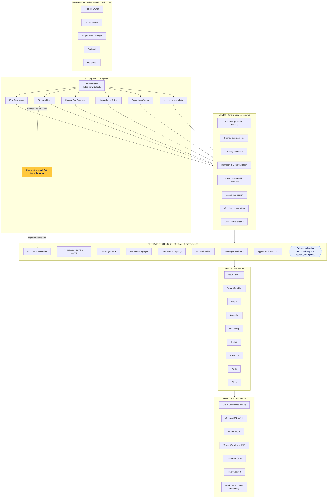
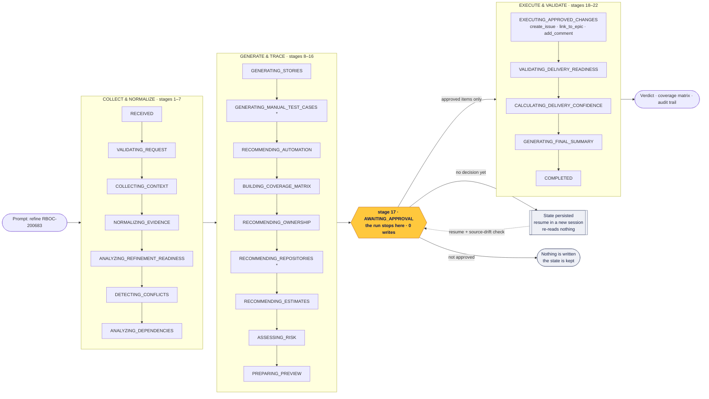

# RefineAI — Architecture and Workflow Diagrams

Canonical Mermaid source for the diagrams drawn on slides 6 and 9 of
[RefineAI-Discover-Hackathon-2026-Solution-Deck.pptx](RefineAI-Discover-Hackathon-2026-Solution-Deck.pptx).
Keep this file and [../../../scripts/buildSubmissionDeck.mjs](../../../scripts/buildSubmissionDeck.mjs) in step.

## 1. High-l evel architecture

Four layers and one rule: anything reproducible is code, anything needing judgement is a
prompt, and any procedure with refusals is a skill. Sixteen agents can analyse; exactly one
can write.

## 2. End-to-end workflow

One resumable run of 22 named stages. Every stage records `DONE`, `SKIPPED` with a reason, or
`FAILED`, so a stage that did not apply is never confused with one that was forgotten.

`*` optional stages — skipped with a recorded reason, never silently absent. In `DRAFT` and
`ANALYZE_ONLY` modes the gate itself is skipped with a recorded reason, because no write is
imminent.
